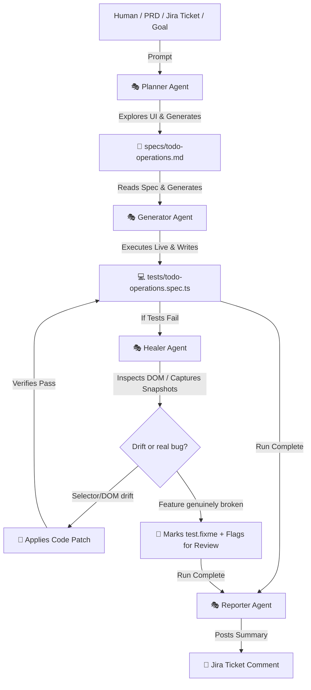

# Architecture: Playwright Test Agents

Playwright Test Agents represent a revolutionary, AI-driven paradigm in End-to-End (E2E) testing. Introduced in Playwright, these agents automate E2E test planning, script generation, and maintenance. They operate as a coordinated system of specialized AI prompts and tools integrated via the **Model Context Protocol (MCP)**.

---

## 🏗️ The Agentic Suite

The framework splits responsibilities among three highly specialized agents. This separation ensures that the strategist does not get bogged down in syntax, and the fixer does not lose sight of the target user flow.



### 1. 🎭 The Planner Agent (`playwright-test-planner.agent.md`)
Acts as the **strategist and E2E designer**. It is designed to navigate and discover the visual structure of your application.
- **Input**: Natural language request (e.g., *"Test the todo management filtering system"*), custom seed tests (`tests/seed.spec.ts`), and optional PRDs or Jira ticket acceptance criteria.
- **Action**: Runs the seed test to launch a page context, explores the page utilizing browser tools (clicking, typing, analyzing lists), maps out flows, and captures boundary states.
- **Output**: A comprehensive, human-readable Markdown test plan saved under `specs/` (e.g., `specs/todo-operations.md`).

### 2. 🎭 The Generator Agent (`playwright-test-generator.agent.md`)
Acts as the **software development engineer in test (SDET)**. It converts structured Markdown test plans into actual TypeScript/JavaScript tests.
- **Input**: The Markdown plan from the `specs/` folder.
- **Action**: Steps through the test cases in the plan sequentially. For each step, it runs a live browser interaction to verify selectors, check visibility, type, and record success. It records every interaction and turns it into clean, maintainable Playwright code.
- **Output**: Clean, standard Playwright E2E spec files under `tests/` (e.g., `tests/todo-operations.spec.ts`).

### 3. 🎭 The Healer Agent (`playwright-test-healer.agent.md`)
Acts as the **automated E2E maintenance system**. It resolves the notorious "flaky or broken tests" problem when UI structures or selectors change.
- **Input**: Failing test name and failure log.
- **Action**: Plays back the failing steps, pauses at the error, and captures page snapshots. It re-evaluates the page's active DOM tree to look for matching buttons, inputs, or new selectors.
- **Output**: An updated and corrected test suite with resilient locators (or skips the test by marking it `test.fixme()` if the feature is genuinely broken).

### 4. 🎭 The Reporter Agent (`playwright-test-reporter.agent.md`)
Acts as the **liaison back to the business**. It closes the loop between automated test runs and the originating Jira ticket.
- **Input**: The completed test run (including any healing that occurred) and the source Jira ticket key.
- **Action**: Summarizes pass/fail results per scenario, calls out any healed selectors or `test.fixme()` skips, and restates any unresolved acceptance-criteria ambiguities. Never re-runs, generates, or fixes tests itself.
- **Output**: A posted comment on the Jira ticket summarizing the run.

---

## 🔌 Model Context Protocol (MCP) Integration

At the heart of Playwright Test Agents is **MCP (Model Context Protocol)**. MCP acts as a secure API channel allowing your LLM of choice (e.g., Claude, Gemini, GPT) to call local browser automation tools safely inside your workspace.

### The MCP Bridge
When you run `npx playwright init-agents`, it provisions an MCP Server configuration:

```json
{
  "mcpServers": {
    "playwright-test": {
      "type": "stdio",
      "command": "npx",
      "args": [
        "playwright",
        "run-test-mcp-server"
      ],
      "tools": ["*"]
    }
  }
}
```

### Tools exposed to the LLM via MCP:
- **`playwright-test/browser_click`**: Interacts with page elements.
- **`playwright-test/browser_snapshot`**: Captures the state of the active DOM tree.
- **`playwright-test/browser_type`**: Enters text fields safely.
- **`playwright-test/generator_read_log`**: Captures Playwright action histories.
- **`playwright-test/generator_write_test`**: Saves the generated code directly to disk.
- **`playwright-test/test_debug`**: Systematically runs and pauses on failing steps.

---

## 💎 Best Practices for Agentic Testing

> [!TIP]
> **Always Maintain a Quality Seed Test**
> Playwright Test Agents rely heavily on the `seed.spec.ts`. Your seed test should set up all global state (authentication, cookies, setup, base URLs, and layout checks). It acts as the "bootstrap execution context" that the Planner and Generator use to initialize their live browser sessions.

> [!NOTE]
> **Audit Agent Output**
> While the Generator and Healer are incredibly capable, you should always review the E2E code they output. Confirm that selectors use standard accessibility attributes (like `getByRole` or `getByPlaceholder`) and thatassertions verify user-facing actions rather than internal CSS styles.

> [!WARNING]
> **Avoid Hard-coded Timeouts**
> Playwright has robust built-in auto-waiting mechanism. Avoid introducing manual wait delays (like `page.waitForTimeout()`) in your specifications or seeds, as it interferes with the Healer's ability to find element states and causes flakiness.
