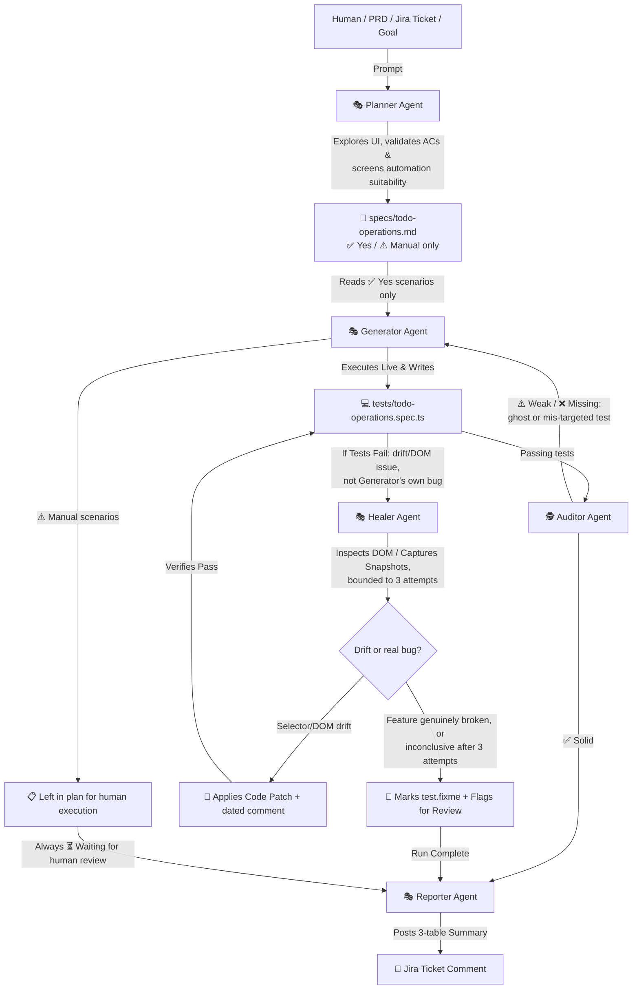

# Architecture: Playwright Test Agents

Playwright Test Agents represent a revolutionary, AI-driven paradigm in End-to-End (E2E) testing. Introduced in Playwright, these agents automate E2E test planning, script generation, and maintenance. They operate as a coordinated system of specialized AI prompts and tools integrated via the **Model Context Protocol (MCP)**.

---

## 🏗️ The Agentic Suite

The framework splits responsibilities among specialized agents. This separation ensures that the strategist does not get bogged down in syntax, the fixer does not lose sight of the target user flow, and the auditor keeps everyone honest about what "passing" really means.



> The `A` node lists the four equivalent entry points that can kick off the Planner — not sequential steps, just alternative input sources:
> - **Human**: a person typing a plain-language prompt directly in Copilot Chat (e.g., "test the header search").
> - **PRD**: a Product Requirements Document describing the feature to be tested.
> - **Jira Ticket**: an existing Jira issue read via Jira MCP, using its acceptance criteria as the source of truth.
> - **Goal**: a high-level objective given with no other formal artifact (e.g., "cover the checkout flow").

### 1. 🎭 The Planner Agent (`playwright-test-planner.agent.md`)
Acts as the **strategist and E2E designer**. It is designed to navigate and discover the visual structure of your application.
- **Input**: Natural language request (e.g., *"Test the todo management filtering system"*), custom seed tests (`tests/seed.spec.ts`), and optional PRDs or Jira ticket acceptance criteria.
- **Action**: Runs the seed test to launch a page context, explores the page utilizing browser tools (clicking, typing, analyzing lists), maps out flows, captures boundary states, and validates each acceptance criterion against observed behavior — flagging anything ambiguous or contradictory instead of guessing. It then **screens every scenario for automation suitability** against five criteria (determinism, UI stability, execution frequency, technical feasibility, risk/business value), labeling each `✅ Yes` or `⚠️ Manual/Exploratory only`.
- **Output**: A comprehensive, human-readable Markdown test plan saved under `specs/` (e.g., `specs/todo-operations.md`), with a summary table mapping every scenario to its verdict and rationale.

### 2. 🎭 The Generator Agent (`playwright-test-generator.agent.md`)
Acts as the **software development engineer in test (SDET)**. It converts structured Markdown test plans into actual TypeScript/JavaScript tests — but only for scenarios the Planner already marked `✅ Yes`.
- **Input**: The Markdown plan from the `specs/` folder.
- **Action**: Skips any scenario marked `⚠️ Manual/Exploratory only` (or unlabeled). For each remaining scenario, it steps through the plan sequentially, running a live browser interaction to verify selectors, check visibility, type, and record success, preferring accessible locators (`getByRole`, `getByLabel`, `getByText`). It writes the test, then **runs it immediately** to confirm it passes before reporting completion. On failure, it distinguishes its own authoring mistakes (self-corrects once) from genuine selector/DOM/app-behavior issues (leaves as-is, flags for the Healer).
- **Output**: Clean, standard Playwright E2E spec files under `tests/` (e.g., `tests/todo-operations.spec.ts`), plus a three-group run summary: passing, failing (needs Healer), and skipped.

### 3. 🎭 The Healer Agent (`playwright-test-healer.agent.md`)
Acts as the **automated E2E maintenance system**. It resolves the notorious "flaky or broken tests" problem when UI structures or selectors change — within a bounded budget, not indefinitely.
- **Input**: Failing test name and failure log.
- **Action**: Plays back the failing steps, pauses at the error, and captures page snapshots. It re-evaluates the page's active DOM tree to look for matching buttons, inputs, or new selectors, applying **at most 3 diagnosis-and-fix attempts per test**.
- **Output**: An updated and corrected test suite with resilient locators and a dated inline comment explaining each fix (e.g. `// healed 2026-08-20: ...`) — or, if the feature is genuinely broken or the attempt cap is reached without a clear verdict, a `test.fixme()` skip with a comment stating explicitly whether it's a confirmed regression or an inconclusive diagnosis needing human investigation.

### 4. 🕵️ The Auditor Agent (`playwright-test-auditor.agent.md`)
Acts as the **read-only quality gate** between generation/healing and reporting. Its single job is to catch the gap between a test that *passes* and a test that actually *validates* something — a "ghost test" that clicks around but never asserts will show green to the runner yet prove nothing.
- **Input**: The full test plan content (with every scenario's `✅`/`⚠️` verdict) and the generated `.spec.ts` files under `tests/`.
- **Action**: For each `✅ Yes` scenario, reads the corresponding test and checks it against six criteria — has a real assertion, targets the scenario's stated expected result, asserts user-facing behavior (not CSS/internal IDs), uses resilient accessible locators, has no hard-coded waits, and maps 1:1 to the plan. It never runs, edits, mutates, or heals tests; it only reads and judges. Scenarios marked `⚠️ Manual/Exploratory only` are out of scope, so their absence from `tests/` is never a finding.
- **Output**: Two scannable tables — verdict counts and per-scenario detail — classifying each test as `✅ Solid`, `⚠️ Weak` (ghost/mis-targeted/fragile), or `❌ Missing`. Weak and missing tests are routed back to the Generator; well-written but genuinely broken ones go to the Healer.

### 5. 🎭 The Reporter Agent (`playwright-test-reporter.agent.md`)
Acts as the **liaison back to the business**. It closes the loop between automated test runs and the originating Jira ticket, covering the *entire* plan — automated and manual scenarios alike.
- **Input**: The completed test run (including any healing that occurred), the full test plan content (with every scenario's `✅`/`⚠️` verdict), and the source Jira ticket key.
- **Action**: Cross-references the plan against `test_list` to classify each automated scenario as Passing, Healed, Skipped (test.fixme), or Not yet run. Every manual/exploratory scenario is always reported as ⏳ *Waiting for human review* — never Pass/Fail. Never re-runs, generates, or fixes tests itself.
- **Output**: A posted Jira comment structured as up to three tables: summary counts, automated scenario detail, and manual/exploratory scenario detail.

---

## 🔌 Model Context Protocol (MCP) Integration

At the heart of Playwright Test Agents is **MCP (Model Context Protocol)**. MCP acts as a secure API channel allowing your LLM of choice (e.g., Claude, Gemini, GPT) to call local browser automation tools safely inside your workspace.

### The MCP Bridge
When you run `npx playwright init-agents`, it provisions an MCP Server configuration:

```json
{
  "mcpServers": {
    "playwright-test": {
      "type": "stdio",
      "command": "npx",
      "args": [
        "playwright",
        "run-test-mcp-server"
      ],
      "tools": ["*"]
    }
  }
}
```

### Tools exposed to the LLM via MCP:
- **`playwright-test/browser_click`**, **`browser_type`**, **`browser_hover`**, **`browser_drag`**: Interacts with page elements.
- **`playwright-test/browser_snapshot`**: Captures the state of the active DOM tree.
- **`playwright-test/browser_verify_element_visible`**, **`browser_verify_text_visible`**, **`browser_verify_value`**: Generator assertions verified live before being written to code.
- **`playwright-test/planner_setup_page`** / **`planner_save_plan`**: Bootstraps the Planner's browser session and persists the finished plan.
- **`playwright-test/generator_setup_page`**, **`generator_read_log`**, **`generator_write_test`**: Captures Playwright action histories and saves the generated code directly to disk.
- **`playwright-test/test_run`**: Runs one or more spec files and reports pass/fail, used by the Generator to confirm a newly written test passes.
- **`playwright-test/test_debug`**, **`test_list`**: Systematically runs and pauses on failing steps (Healer), and lists current test status (Auditor and Reporter).
- **`com.atlassian/atlassian-mcp-server/getJiraIssue`**, **`addCommentToJiraIssue`**: Reads ticket acceptance criteria (Planner) and posts the run summary back (Reporter).

---

## 💎 Best Practices for Agentic Testing

> [!TIP]
> **Always Maintain a Quality Seed Test**
> Playwright Test Agents rely heavily on the `seed.spec.ts`. Your seed test should set up all global state (authentication, cookies, setup, base URLs, and layout checks). It acts as the "bootstrap execution context" that the Planner and Generator use to initialize their live browser sessions.

> [!NOTE]
> **Audit Agent Output**
> While the Generator and Healer are incredibly capable, you should always review the E2E code they output. Confirm that selectors use standard accessibility attributes (like `getByRole` or `getByPlaceholder`) and that assertions verify user-facing actions rather than internal CSS styles. The **Auditor Agent** automates the first pass of exactly this review — flagging ghost tests, mis-targeted assertions, and fragile locators — but a human sign-off on its findings is still recommended.

> [!WARNING]
> **Avoid Hard-coded Timeouts**
> Playwright has robust built-in auto-waiting mechanism. Avoid introducing manual wait delays (like `page.waitForTimeout()`) in your specifications or seeds, as it interferes with the Healer's ability to find element states and causes flakiness.

> [!TIP]
> **Trust the Planner's Automation Verdict**
> Not every scenario the Planner writes down should become code. Scenarios labeled `⚠️ Manual/Exploratory only` (subjective judgment, unstable UI, non-repeating checks, or unsimulable external systems) are intentionally left out of the Generator's scope — don't ask the Generator to automate them anyway; route them to a human tester instead.
